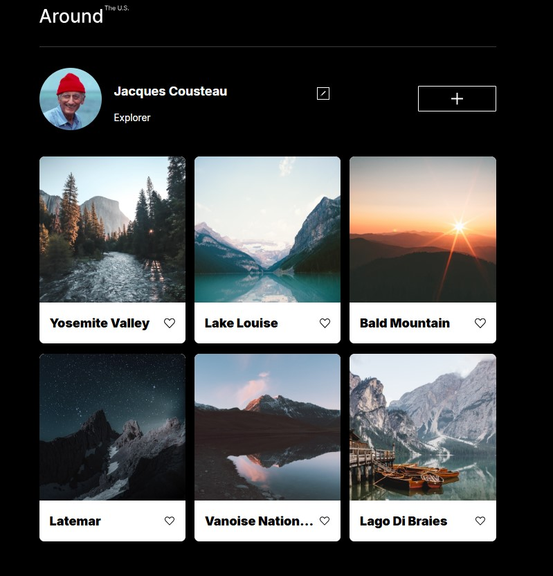
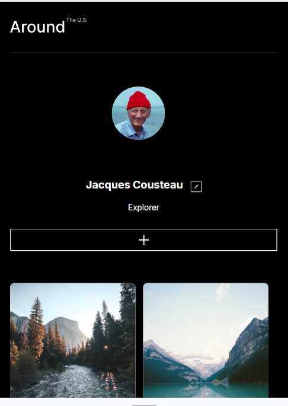

# Around the U.S.

## 🌍 Project Description

**Around the U.S.** is a responsive photo gallery web page that displays a collection of travel destinations using interactive cards. Users can view location names, user profiles, and interact with icons on each card. This project emphasizes responsive layout design, clean CSS architecture, and semantic HTML.

## 🛠️ Technologies and Techniques Used

- **HTML5** for semantic structure
- **CSS3** for styling
- **Grid and Flexbox** for layout
- **BEM Methodology** for class naming and file organization
- **Media Queries** for responsive design
- **normalize.css** for consistent rendering across browsers
- **Google Fonts: Poppins**, with system font fallbacks

## 📐 Project Features

- Responsive layout across 320px, 768px, and 1440px breakpoints
- Mobile-first and web design with no horizontal scroll
- Clean Flat BEM file structure
- Semantic HTML tags: <header>, <main>, <footer>, <section>, etc.
- 6 interactive photo cards featuring place names
- Profile section with editable details
- Accessible interactive elements with hover states

## 🖼️ Screenshots

_(Add screenshots by uploading them to the `images/` folder and linking like below)_

```md


```

## 🔗 GitHub Pages Link

[Live Project on GitHub Pages](https://samira1356.github.io/se_project_aroundtheus/)

## 📁 Folder Structure

```
.
├── blocks/
├── images/
├── pages/
│   └── index.css
├── vendor/
│   ├── fonts.css
│   ├── normalize.css
│   └── fonts/
├── index.html
├── .gitignore
├── .prettierignore
└── README.md
```

## ✅ Validation & Formatting

- HTML and CSS validated with [W3C Validator](https://validator.w3.org/)
- Code formatted using **Prettier**

## 🧠 What I Learned

- Applying the BEM methodology effectively
- Managing responsive layouts with Grid and Flexbox
- Importance of semantic HTML and accessibility
- Structuring real-world projects with developer workflows
